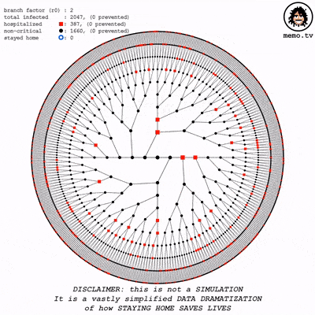
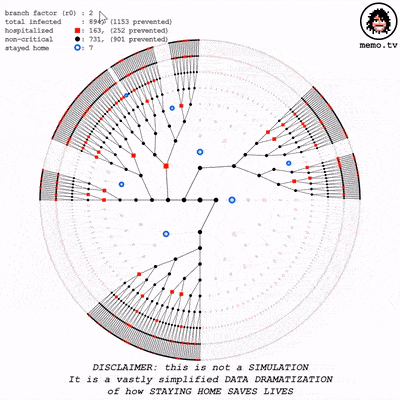
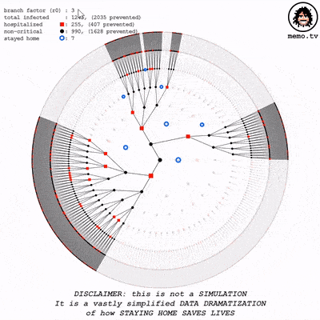
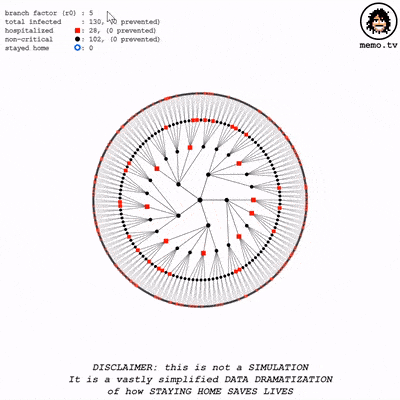

# STAY HOME SAVE LIVES

A quick demonstration of the impact of **exponential growth**, and in the case of an epidemic such as #COVID19, how a single individual can quickly be responsible for the infection of thousands - if not tens or hundreds of thousands - of other people.

So a single individual deciding to **stay home** and not get infected, can prevent many others from getting infected, and save many lives.

DISCLAIMER: This is not a **simulation**. It is a vastly simplified **Data Dramatization** of how **Staying Home Saves Lives**.

For video and live version please see http://www.memo.tv/portfolio/stayhomesavelives/

## Acknowledgements

Made with [p5js](https://p5js.org/)

## License
This program is free software: you can redistribute it and/or modify
it under the terms of the GNU General Public License as published by
the Free Software Foundation, either version 3 of the License, or
(at your option) any later version.

This program is distributed in the hope that it will be useful,
but WITHOUT ANY WARRANTY; without even the implied warranty of
MERCHANTABILITY or FITNESS FOR A PARTICULAR PURPOSE.  See the
GNU General Public License for more details.

You should have received a copy of the GNU General Public License
along with this program.  If not, see <https://www.gnu.org/licenses/>.